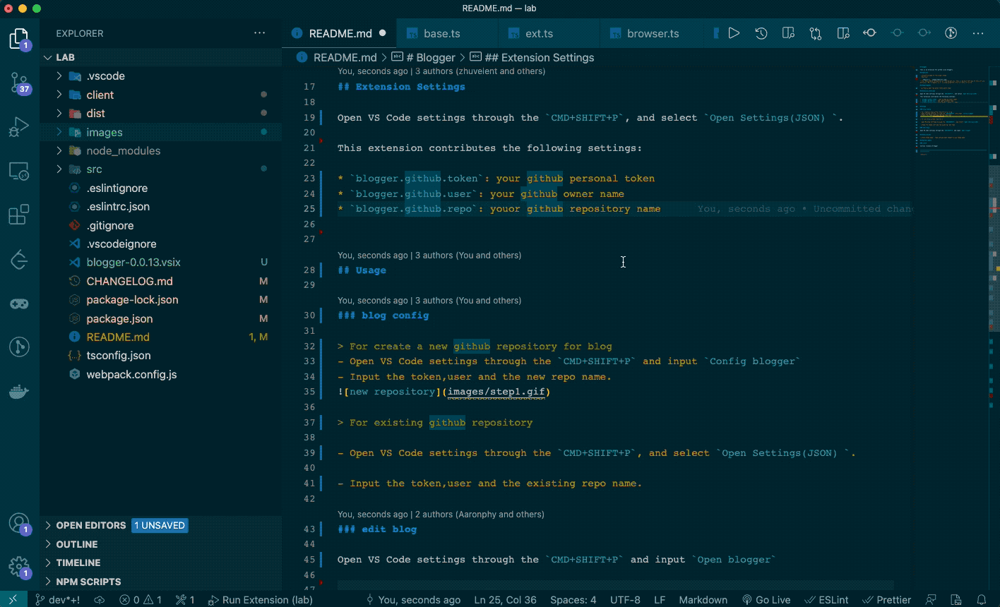
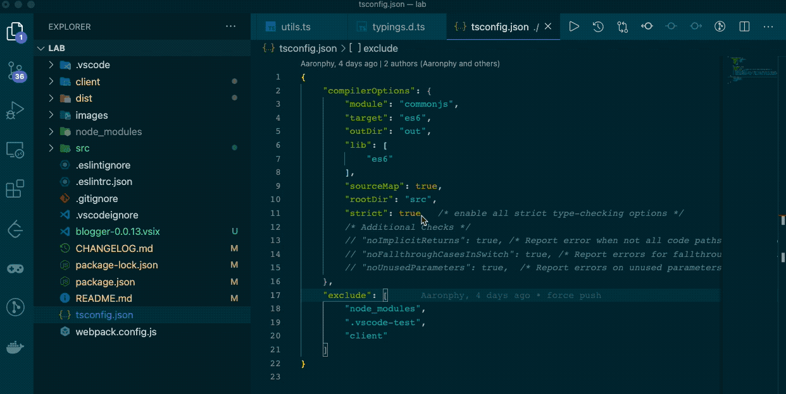

# Blogger

This is an extension for github issue bloggers.

## Features

- use github apis to store your blogs
- easy to use

## Requirements

- github account (personal token,owner,repo)

## Extension Settings

Open VS Code settings through the `CMD+SHIFT+P`, and select `Open Settings(JSON) `.

This extension contributes the following settings:

* `blogger.github.token`: your github personal token
* `blogger.github.user`: your github owner name
* `blogger.github.repo`: youor github repository name

## Usage

### blog config

> For create a new github repository for blog
- Open VS Code settings through the `CMD+SHIFT+P` and input `Config blogger`
- Input the token,user and the new repo name.

> For existing github repository

- Open VS Code settings through the `CMD+SHIFT+P`, and select `Open Settings(JSON) `.

- Input the token,user and the existing repo name.

### edit blog

Open VS Code settings through the `CMD+SHIFT+P` and input `Open blogger`.

## Known Issues

* dark mode , next version will support dark mode

## Release Notes

### 1.0.0

Initial release of Blgger

-----------------------------------------------------------------------------------------------------------

**Enjoy!**
